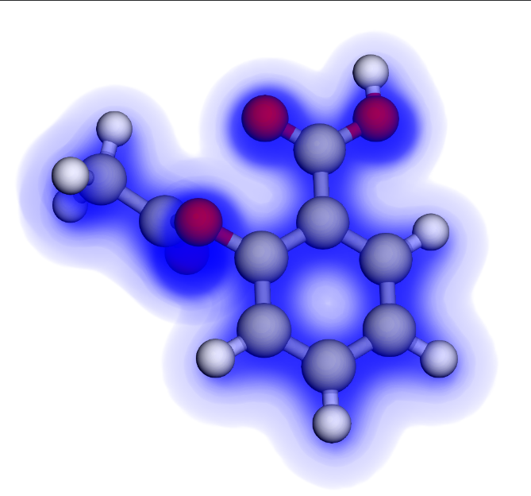

[](https://colab.research.google.com/github/lowdanie/hartree-fock-solver/blob/main/notebooks/geometry_optimization.ipynb)

# Slaterform

`slaterform` is a differentiable Hartree-Fock engine written in `jax`.
It includes a native implementation of the necessary electron integrals and supports standard basis sets from [basis set exchange](https://www.basissetexchange.org/).

# Example: Butane Geometry Optimization

Because `slaterform` is written in pure `jax`, it can easily be used to define a differentiable molecular energy function. This function can be minimized in a standard `jax` optimization loop to optimize the molecular geometry.

```python
import jax

import slaterform as sf
import slaterform.hartree_fock.scf as scf

def total_energy(molecule: sf.Molecule):
    """Compute the total energy of the molecule with Hartree-Fock"""
    options = scf.Options(
        max_iterations=20,
        execution_mode=scf.ExecutionMode.FIXED,
        integral_strategy=scf.IntegralStrategy.CACHED,
        perturbation=1e-10,
    )
    result = scf.solve(mol, options)

    return result.total_energy

# Add gradients and JIT compile.
total_energy_and_grad = jax.jit(jax.value_and_grad(total_energy))
```

In this [colab notebook](https://colab.research.google.com/github/lowdanie/hartree-fock-solver/blob/main/notebooks/geometry_optimization.ipynb)
you can select a molecule, optimize the nuclear positions with `optax`, and finally visualize the trajectory of the nuclei and electron density using
[3dmol](https://3dmol.org/doc/index.html). Here is a sample output for [butane](https://en.wikipedia.org/wiki/Butane). We initialize the carbon chain to lie in a straight line, and the optimizer moves it into the classic zig-zag configuration. The blue cloud is rendered by sampling the electron density returned by `scf.solve`.


<table align="center">
  <tr>
    <td width="500px">
    <video src="https://github.com/user-attachments/assets/33a6ad09-6d3f-4b3f-b0d7-8608a40af69a"></video>
</td>
  </tr>
</table>

# Example: Aspirin

Here is a rendering of the electron density generated by `slaterform` for 
[aspirin](https://en.wikipedia.org/wiki/Aspirin). See the [Quick Start](#quick-start)
section for more details.

<p align="center">
  
</p>


# Quick Start

Here is an example which estimates the electronic ground state of water using the STO-3G basis set from
[basis set exchange](https://www.basissetexchange.org/).


```python
import jax
import jax.numpy as jnp

import slaterform as sf
import slaterform.hartree_fock.scf as scf

# Build the H2O molecule with nuclear positions from pubchem and the sto-3g basis set.
mol = sf.Molecule.from_geometry(
    [
        sf.Atom("O", 8, jnp.array([0.0, 0.0, 0.0], dtype=jnp.float64)),
        sf.Atom("H", 1, jnp.array([0.52421003, 1.68733646, 0.48074633], dtype=jnp.float64)),
        sf.Atom("H", 1, jnp.array([1.14668581, -0.45032174, -1.35474466], dtype=jnp.float64)),
    ], basis_name="sto-3g",
)

# Jit compile and run SCF to solve for the energy.
result = jax.jit(scf.solve)(mol)

print(f"Total Energy: {result.total_energy} H")
print(f"Electronic Energy: {result.electronic_energy} H")
```

Output:

```
Total Energy: -74.96444760738025 H
Electronic Energy: -84.04881211726543 H
```

We can now evaluate the electron density on the points of a grid and save the result to a
[cube file](https://cubefile.readthedocs.io/en/latest/) so that we can render it with tools like
[3dmol](https://3dmol.org/doc/index.html).

```python
grid = sf.analysis_grid.build_bounding_grid(mol)
density_data = sf.analysis.evaluate(result.basis.basis_blocks, result.density, grid)

with open('density.cube', 'w') as f:
    sf.analysis.write_cube_data(
        mol=mol, grid=grid, data=density_data,
        description="density", f=f
    )
```

Here is what the result looks like rendered by [3dmol](https://3dmol.org/doc/index.html):

<p align="center">
  
</p>

# Installation 

```bash
git clone https://github.com/lowdanie/hartree-fock-solver.git
cd hartree-fock-solver

pip install -e .
```

# Tests

This project uses `pytest` for testing and `pytest-cov` for coverage.

```bash
# Run the standard test suite (skips slow tests by default)
pytest

# Run all tests (including slow ones)
pytest -m ""

# Check code coverage
pytest --cov=slaterform
```

# Theory

For the details of the math, physics and algorithms behind this library see:

* [Hartree Fock I: Ground State Estimation](https://www.daniellowengrub.com/blog/2025/07/26/scf)
* [Hartree Fock II: Electron Integrals](https://www.daniellowengrub.com/blog/2025/11/14/electron-integrals)


